# Space skirmish: loading, frame service, victory and return

Walk date: 2026-10-01. Remake audited at `e23eed2e39e3984cb04e99d6a1e122b73235a589`.
This is a behaviour inventory and gap review; it changes no game code.
Original behaviour below comes from fresh, read-only debug-build queries. Opaque BF-E evidence
IDs identify the private evidence retained under ignored `out/research/`; they are not symbols.
Data values come from the effective FoC XML and Lua. Unresolved questions are explicitly listed.
The 53 rules compare as **29 differs, 14 missing, 10 same** against our code; eight groups of
unverified questions have explicit reads/captures. Tracking issue: EAWR-953.

The concrete case is M2's Coruscant map, Rebel human in slot 1, Empire AI in slot 2,
pre-built bases and starting forces, seed 67. These are remake fixture choices
(`src/skirmish/start.cpp`, `m2_fixture`), not claimed retail defaults.
Network two-human skirmish and other maps are distinguished below. Campaign return, land
victories, object-level combat and AI decisions are boundary interfaces, not this walk's internals.

The original has three clocks: outer iterations service input, dialogs and audio; admitted logical
frames service battle state; admitted render frames service camera and drawing. A pause closes
the logical gate, not the outer or render gates. Victory registration occurs inside destruction,
whereas the countdown is serviced later in the shared battle update.

```mermaid
flowchart LR
  A[Map load and asset finalization] --> B[Players, ownership, forces, fog, camera]
  B --> C[Local Begin barrier]
  C --> D[Running logical frames]
  D --> E[Immediate victory registration]
  E --> F[Pending: logical frames continue, damage refused]
  F --> G[Countdown matures]
  G --> H[Local results pause]
  H --> I[Exit tears down battle and opens staging]
```

In the tables, **old** compares the earlier lifecycle notes, not another subsystem's internals.
“Missing” there means the earlier notes omit the rule. **Ours** is same, differs or missing
at the audited revision; an ordering difference is not proof of a visible failure. Each gap is
assigned to the ticket groups below. Paths and function names in that column belong to our code.
No rule requires replacing the deterministic partitioned simulation with a serial object loop.

## Loading and the first admitted frame

| ID | Rule and branches | Fresh source | Old | Ours: code and gap |
|---|---|---|---|---|
| WBF-01 | A skirmish load uses a loading thread to load the chosen map with skirmish context. Map header setup initializes and starts the requested battle mode before its map payload is loaded. Saved battles and campaign transitions use different paths. | debug build BF-E79, E85 | Missing | Differs: `LiveSessionView::prepare_m2` constructs content directly, without the retail lifecycle; G2. |
| WBF-02 | Shared mode initialization creates synchronized and presentation object managers, the victory monitor with the current frame, setup and retreat interfaces, and tactical income support when applicable. Space initialization creates scenes, then shared support, camera/controller, movement coordination, fighter occupancy and tracking; attack counters reset. The space maximum speed multiplier is data (`Object_Max_Speed_Multiplier_Space`, stock 1.2). | debug build BF-E03, E11; XML | Missing | Differs: `TacticalSession::create` and `LiveSessionView::prepare_m2` assemble typed tables/state, without a common readiness barrier; G2. Movement multiplier itself is already applied by `src/units/unit_motion.cpp`. |
| WBF-03 | Begin initializes fogged-model support and notifies AI of the mode, enables object service, sets tactical multiplayer-style tech to 1 and notifies UI. This happens before later lobby ownership replacement; it does not establish that retail AI has already made its first decision. | debug build BF-E32, E33 | Missing | Differs: `prepare_m2` creates AI bindings after `build_start`; `LiveSession::start` wraps the completed session. First AI decision belongs to the tactical-AI boundary; G2. |
| WBF-04 | Space map loading reads foreground/object payload and camera bounds, chooses a map environment unless editor or explicitly retained environment, resets fighter occupancy, sets camera distance/FOV/height immediately and locks/bounds the camera. Fallback bounds are -5000..5000 on each map axis, with 400 inset where explicit playable bounds are absent (code constants). | debug build BF-E18 | Missing | Differs: `read_start_inputs`, `MapCameraBridge` and `SpaceEnvironment` resolve separate inputs/configuration. Other-map support is EAWR-908; environment differences EAWR-795; camera boundary EAWR-653. |
| WBF-05 | The load dialog joins loading/asset work, performs synchronized final object fixup, combines presentation objects, reevaluates detail, then calls the appropriate local-skirmish or network post-load callback. Rendering the loading dialog does not itself load map content. | debug build BF-E52, E59, E68 | Missing | Missing: `prepare_m2` has no loading dialog or corresponding UI readiness state; G2. |
| WBF-06 | Local post-load establishes recording/required lobby players, selects new team-marker versus legacy faction-marker ownership remapping from map metadata, enables colorization, rebuilds fog and allocates chosen starting credits. New-marker remapping replaces temporary editor players, applies team relationships, creates required faction AI with lobby difficulty and missing build queues, refreshes visibility/abilities and sets tech 1/population caps. | debug build BF-E75, E65 | Missing (start note covers parts) | Differs: `skirmish::build_start` creates lobby players before map objects; `platform::live_ai` binds final players. Marker/relationship data are present; general local/network startup and difficulty readiness remain G2, EAWR-603. |
| WBF-07 | For each player in ID order, local post-load creates starting companies only for playable factions. If starting-unit-purchase is enabled it selects the default roster first. New markers select team plus index within team; legacy markers select faction and index. The first selected local spawn marker becomes the camera marker and supplies reinforcement facing. Creation attempts the roster in list order, cycling the eligible spawn markers after successful placement. | debug build BF-E75, E47, E93 | Missing (SK-05/SK-11 overlap) | Same for M2: `Builder::add_lobby_player`, `place_companies`; `read_start_inputs` supplies the faction roster. Full purchasing is EAWR-530/#603; this rule does not claim all purchased-roster paths match. |
| WBF-08 | Local post-load installs the selected victory condition inside that same per-player loop, including non-playable players. Five shared lobby choices exist: all enemy units, all base components, command HQ, domination, enemy space starbase. Each is constructed with **210 logical frames** (code constant). The default space choice is authored by `MP_Default_Space_Tactical_Win_Condition`. | debug build BF-E75; XML | Same VT-01/VT-07; missing alternate dispatch | Differs: `skirmish::victory_rules` / `VictoryRules` install only the starbase condition for commandable contenders; EAWR-654 and G3. |
| WBF-09 | Local post-load then attempts prebattle presentation, snaps camera to the local start marker and initializes the sidebar. The intro is gated by `In_Game_Cinematics`, enabled state and delayed-arrival state; the attacking-space cinematic additionally needs a conflict lead and refuses the network branch. Failure uses the ordinary fade rather than assuming a fixed intro countdown. | debug build BF-E75, E43, E50, E51 | Missing | Differs: `prepare_m2` populates ships/UI; `MapCameraBridge` uses map camera configuration. No equivalent intro decision or marker-camera lifecycle; G2, EAWR-653. M2's precise retail intro outcome is U2. |
| WBF-10 | Completion of a local skirmish load enables/shows Begin, plays `GUI_Text_Hint_SFX` and pauses logical progression. Begin/key handling resumes and dismisses the load dialog. Network loading omits the local Begin pause. | debug build BF-E53, E68 | Missing | Missing: `LiveSessionView::start` runs after preparation without this interactive barrier; G2. |
| WBF-11 | Network post-load separately rebuilds required players/ownership/fog, allocates credits, creates starting forces, **allocates credits again**, attempts prebattle presentation, snaps camera, installs victory conditions, then initializes sidebar. Local post-load has no matching second credit-allocation call. This difference must not be replaced with a universal “credits reset after forces” rule. | debug build BF-E39, E75 | Missing | Missing: no network startup in `LiveSession::start`; G2. Local starting-company debit semantics remain U3. |

## Running battle: nesting and service order

These rows are ordered within one outer iteration and its admitted logical frame. Optional
services are skipped when absent; editor/story-only branches are not stock space-skirmish work.

| ID | Rule and branches | Fresh source | Old | Ours: code and gap |
|---|---|---|---|---|
| WBF-12 | After OS input, network/debug synchronization, outgoing traffic and scheduled-event service run outside the logical gate. For active nonnetwork, nonplayback battles, scheduled events can also execute at the current frame outside that gate. Votes/profiles/platform services follow. Thus a paused logical world does not prove that every queued event waits for a new frame. | debug build BF-E17 | Differs TM-10's blanket queue claim | Differs: `LiveSession` holds input until `step_scripted`/the next world step; G1. Whether a particular paused order mutates state immediately is U6. |
| WBF-13 | When foreground, outer service updates audio backend, SFX, music, speech, speech conversations, SFX conversations and weather in that order. Animation-triggered SFX service also has an outer placement. Dialog update, command-bar system update, gameplay-input service, command-bar service and message service precede the logical gate. | debug build BF-E17 | Same TM-07's UI distinction; missing full order | Differs: `ViewerHost`/`BattleAudio::update` and `LiveSessionView::update` are separate Godot presentation paths; no matched global schedule; G1, EAWR-653. |
| WBF-14 | Logical admission requires suitable foreground/network/debug state and the frame synchronizer's permission; synchronization error handling can prevent mode-manager service. Begin-frame and scheduled command execution precede battle-mode work; load-dialog state gates minicinematic service after it. | debug build BF-E17, E02, E42 | Same TM-07; missing gates | Differs: `LiveSession::Impl` has pacing/pause/halt gates but no network/load/sync lifecycle; G1/G2. |
| WBF-15 | Mode-manager logical service orders detail reevaluation, **scoring**, active mode, game vote, voting progress and pending battles. Scoring is not simply appended after all player AI. | debug build BF-E02 | Missing | Missing: `TacticalSession::step` has no scoring-script lifecycle; EAWR-616. |
| WBF-16 | Space service advances an active cinematic first, then battlefield modifiers, space pathfinding refresh, attack/announcement counters and enemy-leader checks, then delegates to shared mode service. | debug build BF-E01 | Missing | Differs: `TacticalSession::step` has movement/hazards/combat phases rather than this service boundary; G1. Hazard/pathfinding interiors belong to their walks. |
| WBF-17 | Space battle music returns to ambient when the attack-age counter exceeds `Music_Space_Battle_To_Ambient_Peace_Seconds` times logical FPS while battle music is active. Stock XML is **15 seconds**. Shared requested ambient reevaluation runs before objects and is suppressed when the results screen is active. | debug build BF-E01, E04, E63; XML | Missing | Differs: `BattleAudio` reads the threshold, but `MusicDirector::tick` switches on greater-than-or-equal rather than strictly greater; requested ambient/results gating differs. EAWR-653 also needs registry reconciliation for the existing reader. |
| WBF-18 | Shared service refreshes speed/type dependencies, handles ambient/briefing/odds presentation, then fog. Fog grids service only when supported, present and setup inactive, for players whose **ID modulo 16 equals frame modulo 16** (code cadence). Fogged models service after those grids. | debug build BF-E04 | Missing | Differs: `TacticalSession::step` services fog near its end, after commands/economy; its rotating cadence belongs to sensors-ui. Pre-object placement differs; G1, EAWR-777. |
| WBF-19 | Object tracking then runs before scene pre-service flush and before either object manager. This is the targeting/AI tracking interface, not a claim that every object has already moved. | debug build BF-E04 | Missing | Differs: session tracking/targeting phases occur among movement/combat phases. Compare observable input ages under G1; tactical-AI and weapons own internals. |
| WBF-20 | Before object service, each player's previous current-income value becomes last-frame income, then current income and maintenance paid are cleared. | debug build BF-E04 | Missing | Differs: `TacticalSession::step` / economy state use their own accounting during the late economy phase; G1, EAWR-728. |
| WBF-21 | Synchronized objects service before presentation objects. An object manager traverses its service list while play is enabled, then applies camera alignment, delayed creations and queued deletes. Per-object service begins with delayed damage and due/enabled behaviours in reverse behaviour-list order, then transforms/model/object Lua and later object support. There is no verified global “all move, then all fire” sweep in this path. | debug build BF-E28, E48 | Missing | Differs: `TacticalSession::step` uses partitioned movement, targeting, orders, projectiles, abilities, durability and squadron phases. This implementation is allowed; visible dependencies need G1 review, not a serial rewrite. |
| WBF-22 | After object managers: timeline update, collision service, movement coordination, setup manager, retreat interface outside editor, then victory countdown outside editor. These are separate calls even where objects also service locomotion/weapons themselves. | debug build BF-E04 | Missing | Differs: session movement/hits run earlier; outcome/countdown is an end-pass/host target. G1 and EAWR-779. Retreat availability in standalone space is U8. |
| WBF-23 | Tactical income-stream service follows the countdown; multiplayer-style tactical credit balancing and pending domination follow income. Land bombing/bombardment calls between countdown and income require land support and are outside stock space. | debug build BF-E04 | Missing | Differs: `TacticalSession::step` late economy precedes fog and victory evaluation; G1, EAWR-728. Domination dispatch is outside default M2; G3. |
| WBF-24 | Matured victory handling follows these shared services. A standalone battle calls its end callback; a child tactical campaign mode follows its parent/galaxy transition. Subtitles and hologram UI have earlier conditional shared placements. End handling does not imply an immediate abort of the surrounding outer frame. | debug build BF-E04, E08 | Same BE-05's local/campaign split; missing frame placement | Differs: `LiveSessionView::update` observes outcome, schedules halt and opens the panel at its presented target; EAWR-616, EAWR-779. |
| WBF-25 | After mode-manager service the outer logical frame services eligible minicinematics, then players in ascending ID. Each player services its AI before its tactical build queue. Global Lua service follows players, then story/tutorial interfaces and campaign-only win checks, mode frame advance, end-frame synchronization and quitting-player processing. | debug build BF-E17, E27, E41, E25, E74, E78 | Missing | Differs: `ScriptedTacticalSession::step` steps world/economy before global scripts; player AI uses script bindings rather than this original player service. G1, EAWR-728; tactical-AI owns its decision cadence. |
| WBF-26 | Independent render admission orders mode render service, minicinematic render, command-bar render, gameplay UI render, UI-scene render, scene drawing, then render-frame advance. Space render services cinematic/FX when active; otherwise selection tether/camera FX/controller/transform, fighter occupancy, then shared rendering. | debug build BF-E17, E36 | Same TM-07's camera/display continue; missing order | Differs: `ViewerHost`/`MapMode` draw from snapshots using Godot frame callbacks; explicit original render nesting is absent. G1, EAWR-653. |

## Pause and speed boundaries

| ID | Rule and branches | Fresh source | Old | Ours: code and gap |
|---|---|---|---|---|
| WBF-27 | Tactical profile speed accepts steps **0..4**; mode-speed adjustment uses a step lookup. The five numeric lookup entries and default were not freshly resolved here (U7); TM-01's numbers are not promoted to new evidence. | debug build BF-E29, E40 | Same step domain; lookup values unverified here | Same verified domain: `src/presentation/ui/time_controls.cpp`, `TimeControls`, and `LiveSessionView` CLI speed validation. |
| WBF-28 | Nonnetwork logical pacing uses a whole-millisecond minimum wait `1000 / target`. Fast forward overrides target to **120**; an active cinematic overrides it to **30**. A zero target bypasses that wait. A paused mode refuses logical admission. | debug build BF-E42 | Same TM-02/TM-03/TM-07 | Same normal/fast-forward pacing and pause: `LiveSession::Impl` interval/wake loop, `TimeControls::target_rate`. Cinematic startup is absent under G2 rather than a second time-control implementation. |
| WBF-29 | Network space pause refuses to pause; multiplayer advancement uses peer/lockstep readiness rather than the standalone target-FPS branch. A one-human synchronization fast path exists. | debug build BF-E35, E42 | Same TM-04 | Missing: no network session/refusal model in `LiveSession::start`; G2. |
| WBF-30 | Logical pause holds mode frame advance and therefore object service/timers/countdown, while outer UI and render/camera service remain reachable. It is not evidence that every presentation particle or animation clock stops. | debug build BF-E17, E35, E42, E78 | Same TM-07; TM-U3 remains unresolved | Same logical hold: `LiveSession::set_paused`, `LiveSessionView::apply_time`; exact effect-clock/camera/audio details U5. |
| WBF-51 | Pause from fast forward ends acceleration before entering pause. Play from pause resumes at the profile speed; beginning fast forward requires play and nonnetwork mode, and ending it restores play. Multiplayer refuses these UI transitions. | debug build BF-E97, E100..E102 | Same TM-04..TM-06 transition states | Same local transitions: `TimeControls::press_pause`, `press_fast_forward`; network absence already G2. Mouse press/release routing remains U7. |
| WBF-52 | Pause requests button flashing, disables/tints fast forward **128,128,128,255** (code), shows the pause shell, jumps its tactical animation to the end, and sets `TEXT_GAME_PAUSED` / `TEXT_BUTTON_RESUME_GAME`. Text uses `Battle_Pending_Message_Color`, stock **255,32,32,240** (XML). Play removes flash/tint, enables fast forward and hides the shell. | debug build BF-E97, E102; XML | Same TM-08..TM-09 | Differs: our `battle_overlay.cpp`/`battle_messages.cpp` provide text and steady pressed art without the full shell/flash; EAWR-617. Flash virtual-call timing and final pose still U5. |
| WBF-53 | Pause/resume explicitly pauses/resumes movies, active positional SFX, active looping 2D SFX, speech and weather. Outer audio service remains reachable; this hook is distinct from stopping all sound or music. | debug build BF-E97, E102 | Same TM-13 | Differs: `BattleAudio::update` uses presented events and continues music/voice service, without the matching explicit category pause/resume lifecycle; EAWR-653/#617. |

## Deciding and pending victory

| ID | Rule and branches | Fresh source | Old | Ours: code and gap |
|---|---|---|---|---|
| WBF-31 | Runtime destruction marks deletion pending and immediately tests tactical victory for a victory-relevant object. Ownership conversion also reevaluates elimination conditions for the converted object and relevant parent container. These are event hooks; the late outer win check is campaign-only. | debug build BF-E83, E84, E70, E25 | Same VT-02 destruction; missing conversion | Differs: `TacticalSession::step` consumes destroyed-unit events only at its final victory pass; EAWR-779. Ownership-triggered reevaluation is G3. |
| WBF-32 | Elimination reevaluation tests enemy players in ID order. In standalone skirmish it tries all-enemy-units, then the relevant land-base/HQ or space-starbase condition for the removed object's role. Registration still requires an installed active condition. | debug build BF-E70, E06 | Same VT-04; missing alternate path | Same default contender ordering: `starbase_destroyed_winner` in `src/sim/tactical/victory.cpp`. Alternate dispatch is G3; immediate placement EAWR-779. |
| WBF-33 | Space-starbase victory checks standing starbase-role objects not owned by the tested player, excluding dead/death clones, non-victory-relevant types and non-playable owners. It wins when none remain; allied starbases still count because the exclusion is ownership, not enemy relationship. | debug build BF-E07 | Same VT-03/VT-05 | Same on M2: `skirmish::victory_rules`, `starbase_destroyed_winner`. Current type selection uses the station proxy documented in EAWR-781; arbitrary mod role fidelity is not established (U4). |
| WBF-34 | A tested nonhuman player also wins if none of the remaining counted starbases is allied to any human. Therefore AI-only and multi-team line-ups are not reduced to “last enemy base”. Two humans have no such AI shortcut. | debug build BF-E07 | Same VT-06 | Same: `starbase_destroyed_winner` reads the human/contender/team lists. Network startup remains G2. |
| WBF-35 | All-enemy-units victory searches remaining enemy victory-relevant objects, excluding deletion-pending/dead objects. Standalone skirmish excludes owners that are neither human nor AI-controlled. The condition must be installed; losing ships is not an alternative automatic win when starbase-only was chosen. | debug build BF-E07, E70, E75 | Missing (explicitly outside VT scope) | Missing: `VictoryCondition` has only none/starbase and `victory_rules` builds station targets; G3. |
| WBF-36 | Base-components/HQ/domination are shared lobby condition branches, not proven selectable stock space choices. Domination requires relevant capture points allied to the tested playable contender and its pending-time service. The examined post-load installer installs no generic elapsed-time victory. Absence of a retail timed-space option is **unverified**, U8. | debug build BF-E07, E75, E24, E04 | Missing | Missing: alternate condition routing in `VictoryCondition`; G3. Do not implement land victory or invent a space time limit from this row. |
| WBF-37 | Registration rejects inactive conditions and every later registration once victory is pending. The first valid winner/data/delay are retained synchronously. Story victory hooks can override progression; tutorial retry can hold a pending countdown at 1. Stock skirmish has no such retry override in this path. | debug build BF-E06, E05 | Same VT-09 | Same first-winner immutability: `TacticalSession::step` checks absent outcome. Same-frame damage exposure remains EAWR-779. |
| WBF-38 | Registration starts tactical win/lose music and, unless text suppressed, local HUD SFX and win/lose text. Winner or ally wins; an enemy loses; neither receives no result message. Story suppression is a conditional branch, not a skirmish default. | debug build BF-E06, E90 | Same BE-01/BE-02/VT-10 | Differs: `LiveSessionView::update`, `BattleAudio::update` and battle message rendering supply the M2 message; full condition/relationship audio routing and suppression are incomplete; EAWR-617/#653. |
| WBF-39 | A new message replaces the old one, uses win/lose colors and the configured win/lose font, and places text at normalized x `0.5 - width/2`, y **0.4** (code). Stock colors are **223,243,255,255** / **255,244,223,255**, font **EmpireAtWar-Bold**, size **24** (XML). Text baseline interpretation remains unverified. | debug build BF-E90; XML | Same BE-03; BE-U1 retained | Same authored looks/placement: `src/presentation/ui/battle_messages.cpp`, `src/presentation/godot/ui/battle_overlay.cpp`; EAWR-311 settles baseline. |
| WBF-40 | Pending victory does **not** halt the battle update. Damage entry refuses health damage entirely while pending; it does not scale damage. Object/movement/AI/production services retain their normal placements until end handling, subject to their own gates. New reinforcement acceptance belongs to the reinforcement walk. | debug build BF-E58, E04, E17 | Differs VT-11's damage-scaling statement | Differs: damage commits in `TacticalSession::step` lack the immediate pending gate; EAWR-703/#779. Reinforcement rejection EAWR-914. |
| WBF-41 | Countdown service subtracts the logical frame delta since its last service, clamps at zero and updates its last-service frame. Pause therefore holds it; pacing changes its wall duration. Initial delay is 210, but the deciding frame's same-frame subtraction can affect the visible completion tick; exact inclusive endpoints require U1. | debug build BF-E05, E75 | Same logical cadence BE-04; differs unconditional T+210 claim VT-11/BEC | Differs: `BattleOutcome::end_tick` is always deciding tick + countdown, consumed by `LiveSession::halt_at`; EAWR-779/#781 and U1. |

## Results, quitting and teardown

| ID | Rule and branches | Fresh source | Old | Ours: code and gap |
|---|---|---|---|---|
| WBF-42 | A matured standalone local battle opens a fullscreen results dialog and pauses tactical progression. Campaign tactical return uses its parent instead. Network tactical completion can first queue a quit event rather than immediately pause/show the same local dialog; from-quit activation has a separate path. | debug build BF-E08, E04 | Same BE-05 local/campaign; missing network | Differs: `LiveSessionView::update` permanently halts at end tick and opens a minimal panel; EAWR-616, G4. |
| WBF-43 | The dialog chooses local win/lose title by winner/ally relationship. If no matured winner exists, an intentional local quitter receives an enemy winner; otherwise quit fallback chooses the local winner, with an enemy fallback if still unresolved. This does not require starbase destruction or the 210-frame normal countdown. | debug build BF-E08 | Missing | Missing: viewer quit closes its host; no authoritative quit outcome or fallback path in `VictoryCondition`/`LiveSessionView`; G4. |
| WBF-44 | Results battle time reads accumulated tactical **milliseconds**, divides by 1000 and formats floor hours/minutes/seconds. It is not calculated from destroyed-object frame or simply logical ticks/30. Which paused/loading intervals contribute to that accumulator is U5. | debug build BF-E09, E73 | Missing BE-05's tally details | Missing: minimal `BattleEnd` state in `LiveSessionView` has no results elapsed-time accumulator; EAWR-616. Keep display wall time out of deterministic hashes. |
| WBF-45 | Results builds destroyed-type counts for locally allied versus enemy sides, unit icons and totals. Each pane has **12 visible entries** with scrolling based on count minus 12 (code). Scoring uses `Score_Cost_Credits` and score scale; numbers additionally come through scoring Lua `Get_Game_Stat_For_Control_ID`, not a generic “credits spent” label. | debug build BF-E09; scoring Lua | Missing BE-05/BE-U2 details | Missing: `TacticalSnapshot` events exist but no equivalent lifetime result panes/score model; EAWR-616/#530. |
| WBF-46 | Scoring Lua service is before active mode, and script threads run only when elapsed logical time exceeds their `ServiceRate`. Stock `gamescoring.lua` authors **10 seconds**. Its loss-value controls calculate efficiency scores, and intentional quit zeroes the applicable ranking/title score; these are scripted definitions, not inferred from control text. | debug build BF-E49, E02; scoring Lua | Missing | Missing: `ScriptedTacticalSession` has AI/global bindings, not this scoring instance/control callback lifecycle; EAWR-616. |
| WBF-47 | Summary win/lose music starts only if its resolved event pointer exists. `Music_Event_Battle_End_Summary_Screen_Win` and `_Lose` are empty in stock XML; the final resolver result was not freshly traced. Replay is hidden unless allowed and network context permits it. | debug build BF-E08; XML | Differs BE-05's unconditional summary music; missing replay gate | Missing: minimal panel lacks summary music/replay gating; EAWR-616/#653. Empty XML is not proof of audible silence (U5). |
| WBF-48 | Intentional quit event synchronously records the player's quit status, notifies scoring and queues quitting-player processing. That processing is after logical end-frame. It deactivates players, may kill their units, and shows an opponent-left message; local departure or fewer than two controllable players routes tactical skirmish to results/teardown. | debug build BF-E31, E91, E17 | Missing | Missing: no player quit event/service in `TacticalSession` or `LiveSession`; G4. Disconnect versus intentional surrender remains distinct; untraced transport policy U8. |
| WBF-49 | Normal local results Exit destroys the dialog, clears results/replay flags and queued music, shuts down targeting HUD/mode/players/sidebar, resets command-bar components and destroys dialogs, restores the menu backdrop and opens **skirmish staging**. Closing the operating-system viewer is not this return path. | debug build BF-E16 | Missing; differs BEP-03 project choice | Differs: `BattleEnd` Quit action closes the viewer rather than rebuilding staging/session UI; EAWR-616, G2. |
| WBF-50 | Network/quit teardown can save recorded events at the final synchronized frame, resume out of pause, reset required players, messages and story flags, stop speech/SFX conversations and active audio events/weather, collect pooled state, and route to the appropriate lobby/menu. It runs through the quitting-player path rather than assuming local results Exit. | debug build BF-E91, E16 | Missing | Missing: `LiveSession::record` records our replay, but no lobby/session reset or network finalization lifecycle exists; G2/G4. |

## Comparison with the previous notes

This audit complements, rather than silently rewriting, the older notes.

| Existing rules | Verdict against this walk |
|---|---|
| VT-01..VT-07, VT-09..VT-10 | Same verified default-condition tests and first-winner semantics (WBF-08, 31..34, 37..38). VT-07's contender-only filter remains an explicit remake restriction; non-playable winning is unresolved. |
| VT-08 / VP-01 | Destructions are evaluated immediately in the original (WBF-31), while VP-01's end-pass is a remake choice. WBF-40 establishes the consequence for later damage. Retail ordering of simultaneous independent hits remains U1. |
| VT-11 / BE-04 | Logical countdown and initial 210 are confirmed; damage scaling is wrong, and exact T+210 presentation is not freshly proven (WBF-40..41). EAWR-703/#779/#781 already own these corrections. |
| VT-12 / VP-02..VP-03 | Project staging/replay/team representations, not newly sourced retail rules. This walk does not reclassify them as debug-build facts. |
| BE-01..BE-03 | Same text/music/SFX registration, relationships and normalized text placement (WBF-38..39); baseline still U5. |
| BE-05 | Local pause/results and campaign split confirmed. Summary music is conditional; tallies, wall-time field, network branch and staging return were missing (WBF-42..50). |
| BEP-01..BEP-04 | Explicit project presentation/recording choices; the minimal panel, permanent halt and process exit differ from the original results lifecycle. |
| TM-01..TM-04, TM-07 | Five-step domain, pacing overrides, logical hold, UI/render split and network distinction confirmed (WBF-27..30). Lookup values/default remain U7 in this fresh audit. |
| TM-10 | Blanket “queue waits for next running frame” overstates the top-level gate: nonnetwork scheduled execution exists outside it (WBF-12). Specific order effects require U6. |
| TM-05..TM-06, TM-08..TM-09, TM-13 | State transitions, flash/banner requests and explicit audio-category hooks freshly confirmed by WBF-51..53. Mouse press/release details and visual flash/banner timing remain U7/U5. |
| TM-11..TM-12 | Camera smoothing and default key-map routing need fresh confirmation U7/U5; earlier evidence alone is not new verification. |
| TP-01..TP-07 | Project host pacing, hashing, input stamping, track/CLI and banner choices remain project rules; no retail replay equivalence is inferred. |
| Missing there | The integrated loading schedule, outer/logical/render nesting, scoring lifecycle, alternate conditions, conversion reevaluation, quit and session teardown are added here. |

## Subsystem interfaces

| Owning walk | Lifecycle handoff recorded here |
|---|---|
| [Movement](movement.md) | Space pathfinding refresh precedes shared objects; object locomotion precedes later coordination. Starting-company placement receives marker position/facing. Do not infer global all-object movement order. |
| [Weapons](weapons.md), [capital combat](capital-combat.md) | Due object behaviours and collision exchange hits/damage; destruction can register victory immediately. Pending damage rejection is a lifecycle gate, not a different projectile model. |
| [Squadrons](squadrons.md) | Starting roster expands craft/company through squadron creation; object/squadron service and render occupancy retain distinct placements. |
| [Abilities](abilities.md) | Ownership remap initializes abilities; object behaviour interfaces service them. Conversion can invoke victory reevaluation. |
| [Production](production.md) | Object income precedes income streams; player AI precedes its build queue, after mode service. Starting credits/rosters are load inputs; score tallies are not production cost guesses. |
| [Sensors and UI](sensors-ui.md) | Fog refresh precedes tracking/objects; HUD/input outer service precedes logical admission, camera/UI render has its own gate. |
| [Tactical AI](tactical-ai.md) | Mode-create/ownership/difficulty establish AI; ascending player service invokes AI before build queues, with global scripts later. Decision and perception internals stay there. |
| [Hazards](hazards.md) | Battlefield modifier service precedes pathfinding/shared service; object managers service authored hazards/map objects. Environment comes from map load. |
| [Reinforcements](reinforcements.md) | Spawn marker sets arrival facing; pending-victory admission and delayed arrivals retain their own rules (EAWR-914). |
| [Heroes](heroes.md) | Purchases/hero identities enter starting/deployment interfaces; scoring/results consume final loss records, not regenerated hero state. |

## XML and Lua audit

Registry status is from `docs/tag-coverage/statuses.json` at the audited revision. This docs-only
walk applies no tags and therefore changes no registry rows. Todo/deferred rows stay gaps even
where a loader parses a value. XML alone supplies values, not the claimed service order.

| Input | Value / lifecycle reader | Registry status and existing ticket |
|---|---|---|
| `MP_Default_Space_Tactical_Win_Condition` | Stock enemy-starbase choice; lobby condition installation WBF-08 | todo, EAWR-654 |
| `MP_Default_Credits` | Stock 6000; chosen lobby credits allocation WBF-06/11 | applied; selected lobby override is a separate lifecycle input |
| `Is_Playable`, `Create_Player_In_Multiplayer_Games` | Player remap/starting roster qualification | applied |
| `Basic_AI_Player` | Faction AI name getter observed during WBF-06; exact authored tag spelling is not established here | unresolved alias; do not invent a registry row |
| `Space_Skirmish_AI_Default_Forces` | Faction starting roster; read by our start loader, passed through WBF-07 | applied; full setup purchasing EAWR-603/#530 |
| `Space_Skirmish_Unit_Buy_Credits` | Nearby purchasing budget; purchasing internals are outside this walk | todo, EAWR-530 |
| `Marker_For_Specific_Object_Type`, `Affiliation` | Marker data supplied to starting placement; exact prebuilt-marker replacement reader remains U3 | marker candidate input applied; affiliation outside this lifecycle's newly traced readers |
| `Victory_Relevant` | WBF-31/33/35 | StarBase applied; SpaceUnit **deferred EAWR-650**; Marker todo EAWR-650; cinematic/land rows remain out of scope |
| `Space_Victory_Relevant` | Space-specific structure relevance input; inherited/alias resolution not freshly followed | SpecialStructure todo EAWR-650 |
| `In_Game_Cinematics` | Stock true; WBF-09 intro gate | todo, EAWR-653 |
| `Space_Tactical_Camera_Locked` | Stock true; WBF-02/04 | todo, EAWR-653 |
| `Object_Max_Speed_Multiplier_Space` | Stock 1.2; WBF-02 movement boundary | applied |
| Space fog height getter | WBF-04 fog initialization; exact XML alias/default unresolved | U4; no claimed coverage |
| `Audio_Space_3D_Saturation_Distance_Mod` | Stock 1.5; space activation initializes spatial audio scale (BF-E14/E69) | todo, EAWR-650 |
| `Audio_Space_3D_Rolloff_Distance_Mod` | Stock 2.0; same audio initialization | todo, EAWR-649 |
| `Audio_Space_3D_Listener_Z_Pullback_Dist` | Stock 60; adjacent listener/camera boundary, not freshly traced by this walk | todo, EAWR-650; existing audio note owns application |
| `Music_Space_Battle_To_Ambient_Peace_Seconds` | Stock 15; WBF-17 | todo, EAWR-653 |
| `Win_Message_Color`, `Lose_Message_Color`, `Win_Lose_Message_Font`, `Win_Lose_Message_Font_Size` | WBF-39 values | applied |
| `Battle_Pending_Message_Color` | Stock 255,32,32,240; WBF-52 | applied |
| `Music_Event_Battle_End_Summary_Screen_Win`, `Music_Event_Battle_End_Summary_Screen_Lose` | Authored empty; conditional playback WBF-47 | todo, EAWR-653 |
| `Score_Cost_Credits` | Results/scoring input WBF-45 | Space/skirmish classes todo EAWR-530; land-only rows excluded |
| `ServiceRate` in scoring Lua | 10 seconds; WBF-46 | Lua global, not an XML registry row |

Other-map differences are metadata marker scheme, marker number/order, map bounds/environment,
starting positions and authored objects. No conclusion about force count, starbase placement,
intro duration or available lobby win choices follows merely from choosing a different map.
With two human network peers, Begin/pause/pacing/quit paths change as above; the starbase rule's
AI shortcut does not apply. A two-human setup without network transport is not equivalent.

## Gaps and tickets

One row's status is a boundary verdict, not the count of defects inside a different walk. The
tracking issue is **EAWR-953**; the earlier review EAWR-778 remains linked, not replaced. Duplicate
searches covered global frame order, loading/Begin, all-enemy-units, surrender, camera startup
and staging, and the current lifecycle/coverage issues before filing.

| Group / ticket | Size | Rules and concrete work |
|---|---|---|
| G1 **EAWR-949** | M, bug | WBF-12..14, 16, 18..23, 25..26: establish observable command/fog/tracking/object/income/player-AI/build-queue/global-script boundaries; document approved deterministic phase deviations and test same-frame dependency cases. Preserve partitioned work. |
| G2 **EAWR-950** | M, enhancement | WBF-01..06, 09..11, 14, 29, 49..50: define loading/finalization/Begin readiness and teardown/staging state transitions. Local M2 barrier and clean second battle first; network transport is a separately scoped dependency. |
| G3 **EAWR-951** | M, enhancement | WBF-08, 31, 35..36: data-selected all-enemy-units space condition and ownership-change reevaluation, with human/AI/neutral relevance and installed-condition filters. Land/HQ/domination and space time-limit availability require evidence before expanding scope. |
| G4 **EAWR-952** | M, enhancement | WBF-42..43, 48, 50: authoritative intentional-quit state, score hook, winner fallback and results/teardown routing; distinguish opponent departure from normal countdown. Network disconnect policy is unresolved. |
| EAWR-779; EAWR-703 | S | WBF-31, 37, 40..41: immediate deciding-destruction pending flag and rejection of later damage; confirm countdown endpoint with U1. |
| EAWR-781; EAWR-745 | XS | Correct older end-pass/damage/countdown/proxy claims using WBF-31/40/41; this walk records their limitations without broad unsourced rewrites. |
| EAWR-616 | M (walk estimate) | WBF-15, 24, 42, 44..47, 49: full results pause/UI, elapsed display time, lifetime loss records, scoring script/control callbacks, conditional music/replay and Exit return. G2 owns shared session readiness/teardown plumbing. |
| EAWR-617; EAWR-653 | S/M respectively (walk estimates) | WBF-13, 17, 26, 38, 47, 52..53 and unresolved U5/U7: authored audio/intro/camera/pause presentation. Existing audio PR EAWR-443 is a baseline, not an unresolved work item. |
| EAWR-649/#650/#654; EAWR-530 | M (coverage groups; walk estimate) | XML todo/deferred audit above; alternate victory consumers must update registry rows in the implementing PR. |
| EAWR-795/#908; EAWR-603 | S/M/M (walk estimates) | WBF-04/06/07: environment/map selection and complete AI setup purchasing. |
| EAWR-777/#728/#914 | Existing owning walks | WBF-18/20/23/25/40: fog, production ordering and reinforcement acceptance. Link their sub-issues; do not duplicate their internals. |

Highest impact on M2: immediate pending/damage (EAWR-779/#703), original phase dependencies (G1),
Begin and second-session readiness (G2), complete results/statistics/Exit (EAWR-616), and intentional
quit result flow (G4). Alternate win-condition selection G3 matters once the fixed M2 fixture expands.

## Unverified questions and captures

The following are not original-game rules or authorization to implement an inference. Existing
recordings were not substituted for fresh confirmation. Capture proposals require original-game
jobs; this walk used no GPU, builds or game runs.

| ID | Unresolved question | Smallest evidence that settles it |
|---|---|---|
| U1 | Exact deciding-frame/countdown endpoint and original independent destruction ordering; stock initial delay 210 is confirmed. | Record a single controlled station kill with logical-frame log and results-open frame; repeat simultaneous lethal station hits in both creation/order arrangements, at two speeds and with a pause during pending victory. |
| U2 | Coruscant's actual prebattle intro/fade, first input-enabled frame and first AI decision relative to Begin; callback gates are confirmed, resolved conflict lead is not. | Stock Coruscant local skirmish recording from loading through Begin and first order, plus debug logical frame/input/AI service markers; compare a two-human network load. |
| U3 | Exact pre-built-base marker replacement timing relative to free/purchased companies; local starting-roster credit debit; base-first assumption in `place_companies`. | Trace local and network post-load creation order with prebuilt on/off and purchase on/off, recording credits before/after placement. This requires the marker replacement/placement callee, not guessing from callback order. |
| U4 | General modded starbase role versus remake station proxy; exact space fog-height XML alias/default; non-playable contender victory and self-alliance. | Targeted debug reads of type/tag resolution and relationships, then a three-player/team/nonplayable-base custom scenario only if necessary. |
| U5 | Results time accumulator's treatment of pause/load/end screen; resolved empty summary-music events; text baseline; camera snap, effect/animation and audio pause details. | Retail win and loss captures with long deliberate pauses, audible tracks, camera zoom targets and visible effects, followed by Exit and second battle; compare elapsed display time against wall and logical frames. EAWR-311/#616/#617 own visual capture work. |
| U6 | Which paused commands can execute state changes via the nongated scheduled queue; whether our next-tick-only input differs visibly. | Give move/attack/ability/sell commands while paused, logging command execution and order/state changes separately from movement; resume at a known logical frame. |
| U7 | Fresh speed lookup entries/default, mouse press/release and default key routing; state transitions themselves are confirmed WBF-51. | Read the speed lookup initialization and click handlers/key data; capture five speed settings and pause/fast-forward toggles for visual/clock timing. Earlier TM evidence alone does not close this fresh-audit item. |
| U8 | Stock space lobby availability of time limits/other conditions, retreat versus intentional surrender, and transport-disconnect policy. | Capture all space lobby win-condition choices and in-battle quit/retreat/menu options; run one all-units game, one timed game only if exposed, and two-human quit/disconnect cases. No generic time-limit victory was found in the inspected installer. |

Validation for this docs-only walk: rule/source/code coverage, local link checks, clean-room
scan of added content and publication text, `git diff --check`, and the tag-registry check.
No simulation replay pins move.
